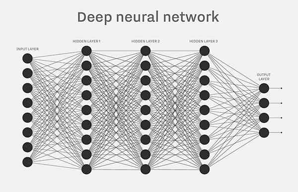
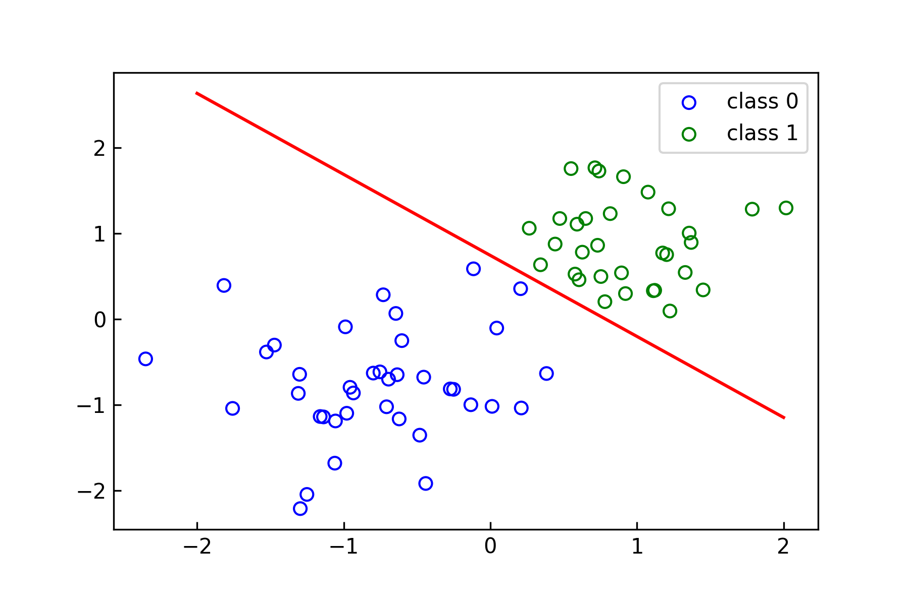
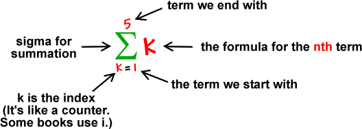
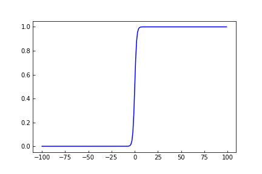
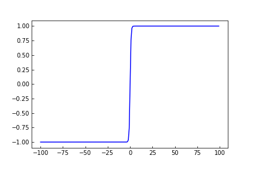

# 第2章 感知机

- 有监督学习
- 分类问题
- 线性分类模型

## 感知机是什么？

你是否听说过复杂的神经网络呢？





感知机可以称为单层的神经网络，而多层的感知机则称为**神经网络**


感知机是二类分类的线性分类模型，其输入为实例的特征向量$T$，输出为实例的类别$y$    即：


$$
T=\{(x_1,y_1),(x_2,y_2),...,(x_N,y_N)\}
$$

$$
y=\{+1,-1\}
$$


用简单的话语来说 感知机在二维平面上的表现就像一个分界线 最大程度的将不同种类的样本区分出来

（当然是属于二分类啦）

### 感知机在二维平面上的认识：

感知机有如下几何解释：线性方程
$$
wx+b=0
$$
对应于特征空间$R^n$中的一个超平面$S$，其中$\omega$是超平面的法向量，$b$是超平面的截距。

因此这个超平面将特征空间划分为两个部分。位于两部分的点分别被分为正、负两类。
$$
sign(x)=
\begin{cases}
1& \text{x>0}\\
0& \text{x<=0}
\end{cases}
$$

$$
f(x)=sign(wx+b)
$$
如下图所示：




## 那么，感知机是如何工作的呢？

### 感知机主要包含4个部分：

- 输入层
- 权值和偏置
- 神经元之和
- 激活函数


### 感知机工作的原理：

1.所有输入的$x$和对应的$\omega$进行内积


2.将内积的值相加 得到的值称为权值和



3.将权值和代入激活函数输出


#### 补充：常用的激活函数

1.$Relu$
$$
f(x)=
\begin{cases}
x& \text{x>0}\\
0& \text{x<=0}
\end{cases}
$$


2.$Sigmoid$
$$
f(x)=\frac{1}{1+e^{-x}}
$$


3.$tanh$
$$
f(x)=\frac{e^{x}-e^{-x}}{e^{x}+e^{x}}
$$



### 权值和偏置的作用：

权值体现了单一神经元的强弱

而偏置可以使得上下移动激活函数


### 激活函数的作用：

因为在神经网络中，每一层输出的都是上一层输入的线性函数，所以无论网络结构怎么搭，输出都是输入的**线性组合** 而线性模型的表达能力不够，引入激活函数是为了添加非线性因素


## 让我们来使用感知机完成对鸢尾花品种的辨别

#### 前提：鸢尾花一共有3个品种，我们拥有的数据是萼片长度和宽度，以及花瓣的长度和宽度，需要你使用感知机来完成对鸢尾花品种的辨别


#### 山鸢花（Iris Setosa）$label=0$：


#### 变色鸢花（Iris Versicolour）$label=1$：


#### 维吉尼亚鸢尾花（Iris Virginica）$lable=2$：


```python
from sklearn import datasets
from sklearn.preprocessing import StandardScaler
from sklearn.linear_model import Perceptron
from sklearn.model_selection import train_test_split
from sklearn.metrics import accuracy_score
import numpy as np

# 加载鸢尾花数据
iris = datasets.load_iris()

X = iris.data
y = iris.target

# 训练集/测试集
X_train, X_test, y_train, y_test = train_test_split(X, y, test_size=0.3)

# 特征缩放
sc = StandardScaler()
sc.fit(X_train)
X_train_std = sc.transform(X_train)
X_test_std = sc.transform(X_test)

# 感知机模型
ppn = Perceptron(eta0=0.1, random_state=0)

# 训练模型
ppn.fit(X_train_std, y_train)

y_pred = ppn.predict(X_test_std)

# 准确率
print('Accuracy: %.2f' % accuracy_score(y_test, y_pred))
:Accuracy: 0.93
```


## 或则我们来看看如何用Python手写一个perceptron分类器！

1.导入相关库

```python
import pandas as pd
import numpy as np
import matplotlib.pyplot as plt
from sklearn.datasets import load_iris

%matplotlib inline
%config InlineBackend.figure_format='svg'
```

2.定义数据集

```python
# load data
iris = load_iris()
df = pd.DataFrame(iris.data, columns=iris.feature_names)
df['label'] = iris.target

df.columns = [
    'sepal length', 'sepal width', 'petal length', 'petal width', 'label'
]
df.label.value_counts()
:	2    50
	1    50
	0    50
	Name: label, dtype: int64
```

3.可视化数据

```python
data = np.array(df.iloc[:100, [0, 1, -1]])
X, y = data[:,:-1], data[:,-1]
y = np.array([1 if i == 1 else -1 for i in y])

# 可视化数据
plt.figure(figsize=(6,4))
plt.tick_params(direction='in')
plt.scatter(df[:50]['sepal length'], df[:50]['sepal width'],c='',edgecolors='b',label='0')
plt.scatter(df[50:100]['sepal length'], df[50:100]['sepal width'],c='',edgecolors='g',label='1')
plt.xlabel('sepal length')
plt.ylabel('sepal width')
plt.legend()
```

4.定义perceptron分类器

```python
class Model:
    def __init__(self):
        self.w = np.ones(len(data[0]) - 1, dtype=np.float32)
        self.b = 0
        self.l_rate = 0.1
        
    def sign(self,x,w,b):
        y = np.dot(x,w) + b
        return y
    
    def fit(self,X_train,y_train):
        is_wrong = False
        while not is_wrong:
            wrong_count = 0
            for d in range(len(X_train)):
                X = X_train[d]
                y = y_train[d]
                if y * self.sign(X,self.w,self.b) <= 0:
                    self.w = self.w + self.l_rate * np.dot(y, X)
                    self.b = self.b + self.l_rate * y
                    wrong_count += 1
            if wrong_count ==0:
                is_wrong = True
        return 'Perceptron Model'
```

5.训练并测试参数

```python
perceptron = Model()
perceptron.fit(X, y)
```

6.决策边界

```python
# display data
x_points = np.linspace(4, 7, 10)
y_ = -(perceptron.w[0] * x_points + perceptron.b) / perceptron.w[1]

plt.figure(figsize=(6,4))
plt.tick_params(direction='in')
plt.scatter(df[:50]['sepal length'], df[:50]['sepal width'],c='',edgecolors='b',label='0')
plt.scatter(df[50:100]['sepal length'], df[50:100]['sepal width'],c='',edgecolors='g',label='1')
plt.plot(x_points, y_,c='r')

plt.xlabel('sepal length')
plt.ylabel('sepal width')
plt.legend()
```


# [以上数据及源代码请点击这里](https://github.com/tsuirak/Statistical-Learning-Methods-lihang)

### 希望各位客官大人能够给我一个小小的star!​


### 参考：

- [统计学习方法]()
- [towards-data-science-perceptron](https://towardsdatascience.com/what-the-hell-is-perceptron-626217814f53)
- [towards-data-science-perceptron](https://towardsdatascience.com/what-is-a-perceptron-210a50190c3b)

