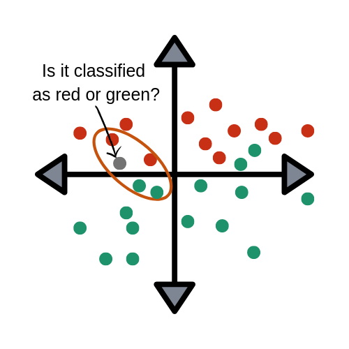
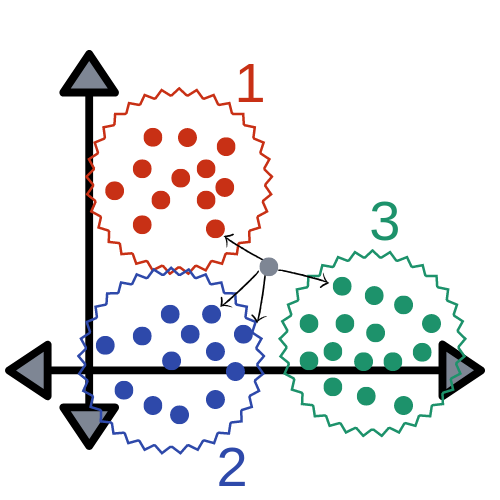
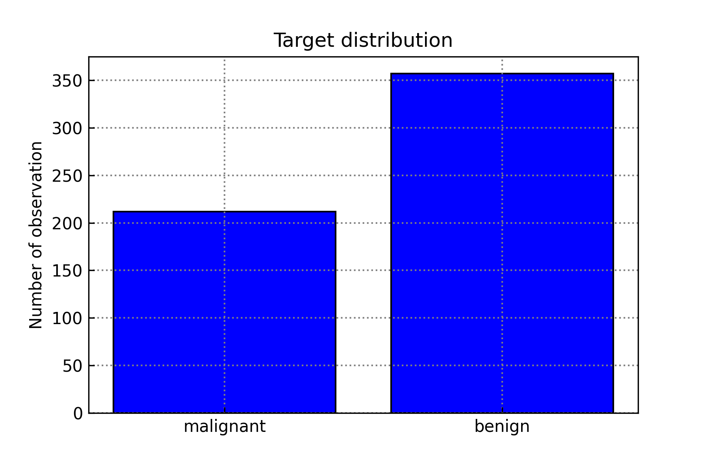
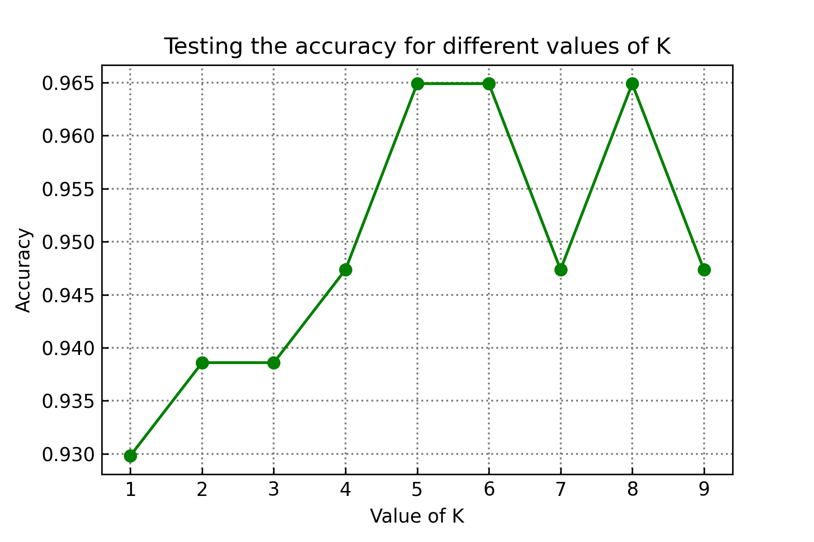
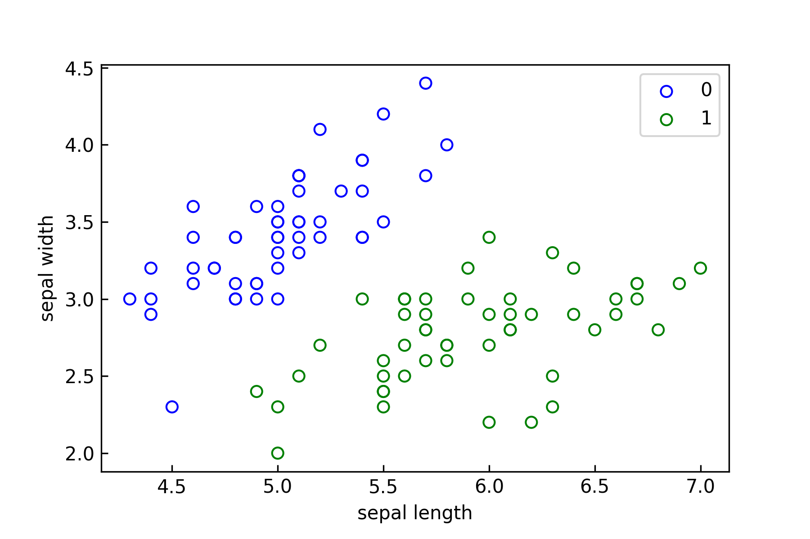
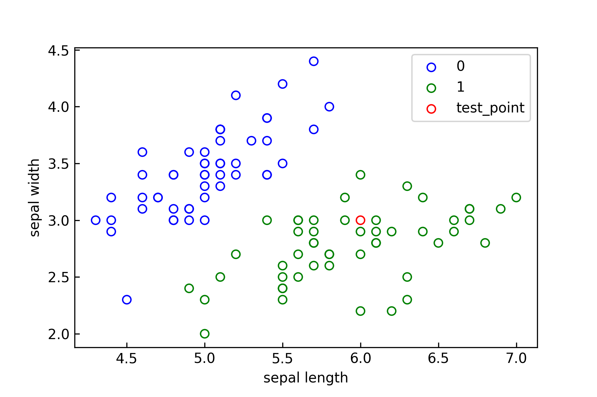

# k近邻

- 有监督学习
- 分类问题

## 什么是k近邻法？

$k-nearest\space neighbor,k-NN$


这里我们讨论分类问题中的$knn$算法

相信大家都听过：“近朱者赤，近墨者黑”

k近邻算法的原理类似，直观，通俗的来讲，给定一个训练数据集，对于新输入的数据，在训练集合中找到与之最近的$k$个数据样本，统计$k$个数据样本的类型，通过**多数表决法则**$(majoroty\space voting\space rule)$，获得选票最多的类别即把该输入的数据分到这个类




上面这张图体现了$knn$算法的问题所在之处

灰色的点到底是归于红色还是绿色呢？

这取决于$k$的取值

而**$k$值的选择**会对$knn$算法的结果产生重大影响


## knn的工作流程

### 1.模型

我们在运用knn算法之前需要确定以下4个部分：

- 训练集

- 距离度量
- $k$值
- 分类决策规则

一旦以上4个准则确定后，对于每个新输入训练实例$x_{i}$，它所属的类别唯一地确定

### 2.距离度量

##### 特征空间中两个实例点的距离是两个实例点相似程度的反映！

我们定义$L_{p}$距离：
$$
L_{p}(x_{i},x_{j})=(\sum_{l=1}^{n}{|x_{i}^{(l)}-x_{j}^{(l)}|^{p}})^{\frac{1}{p}}
$$

- 当$p=2$时，称为欧式距离($Euclidean \space distance$)，即

$$
L_{2}(x_{i},x_{j})=(\sum_{l=1}^{n}{|x_{i}^{(l)}-x_{j}^{(l)}|^{2}})^{\frac{1}{2}}
$$


- 当$p=1$时，称为曼哈顿距离($Manhattan \space distance$)，即
  $$
  L_{1}(x_{i},x_{j})=(\sum_{l=1}^{n}{|x_{i}^{(l)}-x_{j}^{(l)}|})
  $$

- 当$p=∞$时，它代表了各个坐标距离的最大值，即
  $$
  L_{p}(x_{i},x_{j})=max_{l}{|x_{i}^{(l)}-x_{j}^{(l)}|})
  $$


### 3.k值的选择

- 若$k$值较小

  可以理解为用较小的一片区域的训练实例来进行预测

  但这样会导致预测结果对近邻的实例点非常敏感，如若邻近的点恰好是噪声，预测就会出错

  优点：

  - “学习”的近似误差会减小

  缺点：

  - “学习”的估计误差会增大
  - 容易过拟合

- 若$k$值较大

  可以理解为用较大的一片区域的训练实例来进行预测

  这就意味值与输入实例较远的训练实例也会对预测起作用，从而使得预测出错

  优点：

  - “学习”的估计误差会减小

  缺点：

  - “学习”的近似误差会增大

##### 在应用中，我们通常将$k$值选择为一个较小的数值，并且采用交叉验证法​来选取最优的$k$值

下图展示了不同取值$knn$的效果（显然k-5时效果更好）：


### 4.分类决策规则

在$knn$中的分类决策规则往往都是**多数表决**，即由输入实例的$k$个邻近的训练实例中多数类决定输入实例的类




## 让我们来使用k近邻来实践一个问题

#### 前提：假设你是一名医生，你手上拥有着以往乳腺癌患者的数据信息。假如，此时新增一名患者，你需要判断她是否得了乳腺癌。


特征有很多，故不在此展示，有兴趣的同学可以去查看源代码

```python
# 导入需要的库
from sklearn.datasets import load_breast_cancer
from sklearn.model_selection import train_test_split
from sklearn.neighbors import KNeighborsClassifier
from sklearn import metrics
import numpy as np
import matplotlib.pyplot as plt

%matplotlib inline
%config InlineBackend.figure_format='svg'

# 加载数据
dataset = load_breast_cancer()

print(dataset.target_names)
:['malignant' 'benign']

print(dataset.feature_names)
:['mean radius' 'mean texture' 'mean perimeter' 'mean area'
 'mean smoothness' 'mean compactness' 'mean concavity'
 'mean concave points' 'mean symmetry' 'mean fractal dimension'
 'radius error' 'texture error' 'perimeter error' 'area error'
 'smoothness error' 'compactness error' 'concavity error'
 'concave points error' 'symmetry error' 'fractal dimension error'
 'worst radius' 'worst texture' 'worst perimeter' 'worst area'
 'worst smoothness' 'worst compactness' 'worst concavity'
 'worst concave points' 'worst symmetry' 'worst fractal dimension']
  

X = dataset.data
y = dataset.target
occurrences_0 = np.count_nonzero(y == 0)
occurrences_1 = np.count_nonzero(y == 1)

# 划分数据
X_train, X_test, y_train, y_test = train_test_split(X, y, test_size = 0.2, random_state = 123)

# 可视化事件
# 因为数据有30个特征
# 所以我们利用柱状图展示良性和恶性的分布
plt.figure(figsize=(6,4))
plt.tick_params(direction='in')
plt.grid(color='grey', linestyle=':', linewidth=1)
plt.bar(['malignant', 'benign'], [occurrences_0, occurrences_1], color = 'blue', edgecolor = 'black')
plt.ylabel('Number of observation')
plt.title('Target distribution')
```



```python
# 在此我们用for循环来寻找最优的k值
# k:1~10
accuracy_array = []
for k in range(1, 10):
    knn = KNeighborsClassifier(n_neighbors = k)
    knn.fit(X_train, y_train)
    y_prediction = knn.predict(X_test)
    accuracy = metrics.accuracy_score(y_test, y_pred=y_prediction)
    accuracy_array.append(accuracy)
plt.figure(figsize=(6,4))
plt.tick_params(direction='in')
plt.grid(color='grey', linestyle=':', linewidth=1)
plt.plot(range(1, 10), accuracy_array, color='green', marker='o')
plt.xlabel('Value of K')
plt.ylabel('Accuracy')
plt.title('Testing the accuracy for different values of K')
```




```python
# 由上图可知最大的准确值为0.965
# k值分别为5，6，8
# 我们选择5作为最优k值
model = KNeighborsClassifier(algorithm='auto', leaf_size=30, \
                             metric='minkowski', metric_params=None, \
                             n_jobs=None, n_neighbors=1, p=2, weights='uniform')
model.fit(X_train,y_train)
y_prediction = knn.predict(X_test)
accuracy = metrics.accuracy_score(y_test, y_pred=y_prediction)

print(f'accuracy:{accuracy}')

:accuracy:0.9473684210526315
```


## 或则我们来看看如何用Python手写一个knn分类器

数据依然选择鸢尾花数据


1.导入需要的库

```python
import numpy as np
import pandas as pd
import matplotlib.pyplot as plt
from sklearn.datasets import load_iris
from sklearn.model_selection import train_test_split
from collections import Counter

%matplotlib inline
%config InlineBackend.figure_format='svg'
```

2.定义数据集

```python
# sklearn.datasets load_iris
# 一种由4个特征来辨别花的品种的数据集
iris = load_iris()
df = pd.DataFrame(iris.data,columns=iris.feature_names)
df['label'] = iris.target
df.columns = ['sepal length', 'sepal width', 'petal length', 'petal width', 'label']
df.head()
```

3.观察数据并且预处理数据

```python
# 加载数据
iris = load_iris()
df = pd.DataFrame(iris.data,columns=iris.feature_names)
df['label'] = iris.target
df.columns = ['sepal length', 'sepal width', 'petal length', 'petal width', 'label']
df.head()

# 训练集/测试集
data = np.array(df.iloc[:100, [0, 1, -1]])
X, y = data[:,:-1], data[:,-1]
X_train, X_test, y_train, y_test = train_test_split(X, y, test_size=0.2)

# 可视化数据
plt.figure(figsize=(6,4))
plt.tick_params(direction='in')
plt.scatter(df[:50]['sepal length'], df[:50]['sepal width'],c='',edgecolors='b',label='0')
plt.scatter(df[50:100]['sepal length'], df[50:100]['sepal width'],c='',edgecolors='g',label='1')
plt.xlabel('sepal length')
plt.ylabel('sepal width')
plt.legend()
```


#### 只展示前5列数据：

| sepal length | sepal width | petal length | petal length | Label |
| :----------: | :---------: | :----------: | :----------: | :---: |
|     5.1      |     3.5     |     1.4      |     0.2      |   0   |
|     4.9      |     3.0     |     1.4      |     0.2      |   0   |
|     4.7      |     3.2     |     1.3      |     0.2      |   0   |
|     4.6      |     3.6     |     1.4      |     0.2      |   0   |
|     5.0      |     3.6     |     1.4      |     0.2      |   0   |


#### 展示萼片长度和宽度之间的关系：



4.定义knn分类器

```python
class KNN:
    def __init__(self,X_train,y_train,n_neighbors=3,p=2):
        """
        parameter n_neighbors:the value of k
        parameter p:L distance 
        parameter X_train:
        parameter y_train:
        """
        self.n = n_neighbors
        self.p = p
        self.X_train = X_train
        self.y_train = y_train
        
    def predict(self,X):
        knn_list=[]
        # 计算L距离
        for i in range(self.n):
            dist = np.linalg.norm(X-self.X_train[i],ord=self.p)
            knn_list.append((dist,self.y_train[i]))
            
        for i in range(self.n,len(self.X_train)):
            max_index = knn_list.index(max(knn_list,key=lambda x:x[0]))
            dist = np.linalg.norm(X-self.X_train[i],ord=self.p)
            if knn_list[max_index][0] > dist:
                knn_list[max_index] = (dist,self.y_train[i])
                
        knn = [k[-1] for k in knn_list]
        count_pairs = Counter(knn)
        max_count = sorted(count_pairs.items(),key = lambda x:x[1])[-1][0]
        return max_count
    
    def score(self,X_test,y_test):
        right = 0
        n = 10
        for X,y in zip(X_test,y_test):
            label = self.predict(X)
            if label == y:
                right += 1
        return right/len(X_test)
```

5.训练并测试参数

```python
clf = KNN(X_train, y_train)
clf.score(X_test, y_test)
:1.0

test_point = [6.0, 3.0]
print('Test Point: {}'.format(clf.predict(test_point)))
:Test Point: 1.0

# 可视化测试的点
plt.figure(figsize=(6,4))
plt.tick_params(direction='in')
plt.scatter(df[:50]['sepal length'], df[:50]['sepal width'],c='',edgecolors='b',label='0')
plt.scatter(df[50:100]['sepal length'], df[50:100]['sepal width'],c='',edgecolors='g',label='1')
plt.scatter(test_point[0], test_point[1], label='test_point',c='',edgecolors='r')
plt.xlabel('sepal length')
plt.ylabel('sepal width')
plt.legend()
```




# [以上数据及源代码请点击这里](https://github.com/tsuirak/Statistical-Learning-Methods-lihang)

### 希望各位客官大人能够给我一个小小的star!​


### 参考：

- [统计学习方法]()
- [medium-knn](https://medium.com/capital-one-tech/k-nearest-neighbors-knn-algorithm-for-machine-learning-e883219c8f26)
- [heartbeat-knn](https://heartbeat.fritz.ai/understand-the-fundamentals-of-the-k-nearest-neighbors-knn-algorithm-533dc0c2f45a)

