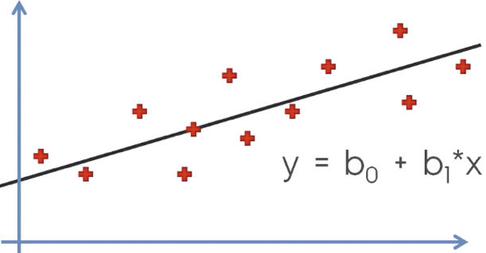
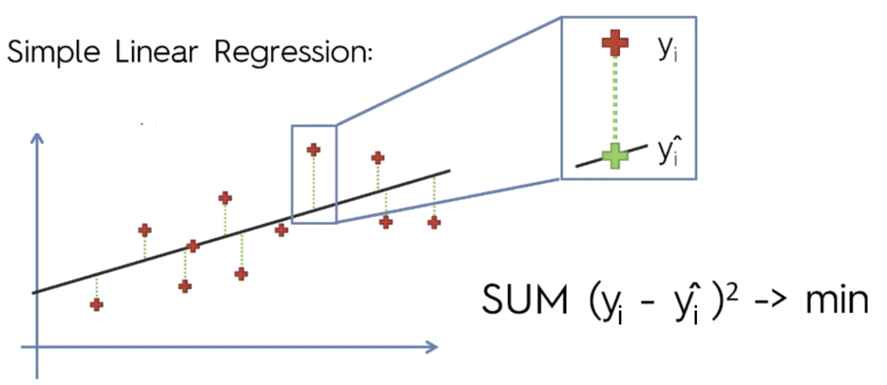
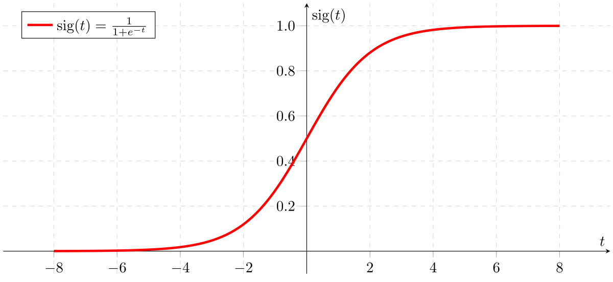
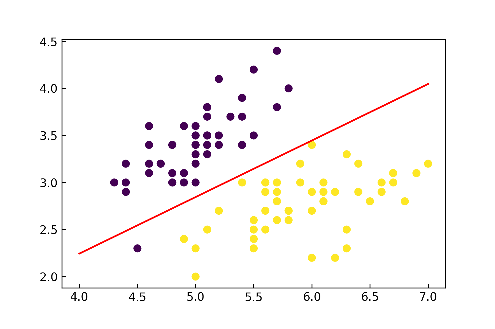

# 逻辑斯谛回归

- 有监督学习

- 对数线性模型
- 分类问题

## 回忆一下线性回归模型！

首先，我相信大家肯定都听过**线性回归**。**线性回归**是一种在预测模型上最简单并且最常用的统计学方法。这是一种使用直线来描述变量之间的关系。类型分为单变量和多变量的线性回归。

单变量$$X$$的线性回归，红色点为样本点。我们可以找到一条黑色的直线使得它能够很好的拟合这些样本点。





#### “问题是我们如何找到这条黑色直线？”

最常用的的方法是**最小二乘法**，即我们通过减小均值平方误差和$$(MSE)$$的大小，即
$$
loss=Sum(y_i-y)
$$


现在，我们有一个分类问题。我们想要得到一个二分类的输出值，即两种取值0或则1。举个简单的例子：掷硬币。结果为正面的话取值为1，反面则为0。

线性回归仅仅用于处理连续性变量而非伯努利变量。线性回归的问题在于对于这些分类不敏感，因为概率应该分布于0到1之间，但是它可能会远大于1或则远小于0。

那么我们如何来预测一个分类问题呢？


## 引入逻辑斯谛回归模型！

让我们来看看如何将线性模型转化为逻辑回归模型～


#### 引入两个概念：概率$$(P)$$和比值比$$(OR)$$

如果成功的概率为$$p$$，那么比值比即为：
$$
OR=\frac{p}{1-p}
$$

|   $$Y$$    | $$1$$ |  $$0$$  |
| :--------: | :---: | :-----: |
| $$P(Y=1)$$ | $$P$$ | $$1-P$$ |


现在，让我们将线性回归模型转化为逻辑回归模型
$$
\begin{equation}
\begin{aligned}
y & = b_0+b_1x\\
\\
ln(\frac{P}{1-P}) & = b_0+b_1x\\
\frac{P}{1-P} & = e^{b_0+b_1x}\\
P & = \frac{e^{b_0+b_1x}}{1+e^{b_0+b_1x}}\\
P & = \frac{1}{1+e^{-y}}
\end{aligned}
\end{equation}
$$


我们可以观察得知，线性回归的输出已经通过$$Sigmoid$$函数转化成了0到1之间的值。


#### 即逻辑回归模型为：

- 输出：{	0	，	1	}
- 假设：$$Z=wx+b$$
- $$h\theta(x)=Sigmoid(Z)$$


让我们来直观认识一下$$Sigmoid$$函数！




即当$$Z$$无穷大时，$$Y$$预测为1

​	当$$Z$$无穷小时，$$Y$$预测为0


## 让我们来使用k近邻来实践一个问题

#### 前提：假设你是一名apple商店的营销员，你本月的目标是增加10%的营业额。因此，你需要知道哪位用户是你的潜在客户！


客户的信息如下：


如果现在我们有一个新的潜在客户，他今年37岁，年收入67,000美元，我们能否预测他是否会购买iPhone（购买？/不购买？）


```python
# 导入库
import numpy as np
import pandas as pd
from sklearn.model_selection import train_test_split
from sklearn.preprocessing import StandardScaler
from sklearn.linear_model import LogisticRegression
from sklearn.metrics import confusion_matrix
from sklearn.metrics import accuracy_score

# 提取数据
dataset = pd.read_csv('Social_Network_Ads.csv')# get dummy variables
dataset.head()

# 特征提取
df_getdummy=pd.get_dummies(data=dataset, columns=['Gender'])
X = df_getdummy.drop('Purchased',axis=1)
y = df_getdummy['Purchased']

# 交叉验证
X_train, X_test, y_train, y_test = train_test_split(X, y, test_size = 0.25, random_state = 0)

# 特征缩放
sc = StandardScaler()
X_train = sc.fit_transform(X_train)
X_test = sc.transform(X_test)

# 逻辑斯谛
clg = LogisticRegression(random_state = 0)
clg.fit(X_train, y_train)
y_pred = clg.predict(X_test)

# 混淆矩阵评估
confusion_matrix(y_test, y_pred)

# 准确率评估
accuracy_score(y_true=y_train, y_pred=clg.predict(X_train))
```


## 或则我们来看看如何用Python手写一个逻辑回归分类器！

1.引入需要的库

```python
from math import exp
import numpy as np
import pandas as pd
import matplotlib.pyplot as plt
from sklearn.datasets import load_iris
from sklearn.model_selection import train_test_split

%matplotlib inline
%config InlineBackend.figure_format = 'svg'
```

2.定义我们的数据集

```python
# sklearn.datasets load_iris
# 一种由4个特征来辨别花的品种的数据集
# 我们仅仅采用两个特征
def create_data():
    iris = load_iris()
    df = pd.DataFrame(iris.data, columns=iris.feature_names)
    df['label'] = iris.target
    df.columns = ['sepal length', 'sepal width', 'petal length', 'petal width', 'label']
    data = np.array(df.iloc[:100, [0,1,-1]])
    return data[:,:2], data[:,-1]
```

3.预处理

``` python
# 将数据集拆分成训练集和测试集合
X, y = create_data()
X_train, X_test, y_train, y_test = train_test_split(X, y, test_size=0.3)
```

4.可视化数据

```python
# 观察数据分布
plt.figure(figsize=(6,4))
plt.tick_params(direction='in')
plt.scatter(X[:,0],X[:,1],c=y)
```


5.定义逻辑回归分类模型

```python
class LogisticReressionClassifier:
    # 定义迭代次数与学习率
    def __init__(self,max_iter = 200,learning_rate = 0.01):
        self.max_iter = max_iter
        self.learning_rate = learning_rate
        
    # 定义sigmoid函数
    def sigmoid(self,x):
        return 1/(1 + np.exp(-x))
    
    # 将数据添加偏置项
    def data_matrix(self,X):
        data_mat = []
        for d in X:
            # 添加偏置
            data_mat.append([1.0,*d])
        return data_mat
    
    # 在训练集上训练参数
    def fit(self,X,y):
        data_mat = self.data_matrix(X)
        # 初始化权值
        self.weights = np.zeros((len(data_mat[0]),1),dtype = np.float32)
        
        for iter_ in range(self.max_iter):
            for i in range(len(X)):
                res = self.sigmoid(np.dot(data_mat[i],self.weights))
                # 损失值
                error = y[i] - res
                # 更新权值
                self.weights += self.learning_rate * error * np.transpose([data_mat[i]])
        print('LogisticRegression Model(learning_rate={},iter={})'.format(\
                    self.learning_rate,self.max_iter))
    # 在测试集上评估参数       
    def score(self,X_test,y_test):
        right = 0
        X_test = self.data_matrix(X_test)
        for x,y in zip(X_test,y_test):
            res = np.dot(x,self.weights)
            if (res > 0 and y == 1) or (res < 0 and y == 0):
                right += 1
            
        return right/len(X_test)
```

6.训练并且测试参数

```python
clf = LogisticReressionClassifier()
clf.fit(X_train, y_train)
:LogisticRegression Model(learning_rate=0.01,iter=200)

clf.score(X_test, y_test)
:0.9666666666666667
```

7.可视化决策边界

```python
# 决策边界

x_ponits = np.arange(4, 8)
y_ = -(clf.weights[1]*x_ponits + clf.weights[0])/clf.weights[2]

plt.figure(figsize=(6,4))
plt.plot(x_ponits, y_,c='r')

plt.tick_params(direction='in')
plt.scatter(X[:,0],X[:,1],c=y)
plt.savefig('./fig/fig2',dpi=300)
```




# [以上数据及源代码请点击这里]()

### 希望各位客官大人能够给我一个小小的star!​


### 参考：

- [统计学习方法]()
- [vebuso-logistic-regression](https://www.vebuso.com/2020/02/linear-to-logistic-regression-explained-step-by-step/)

